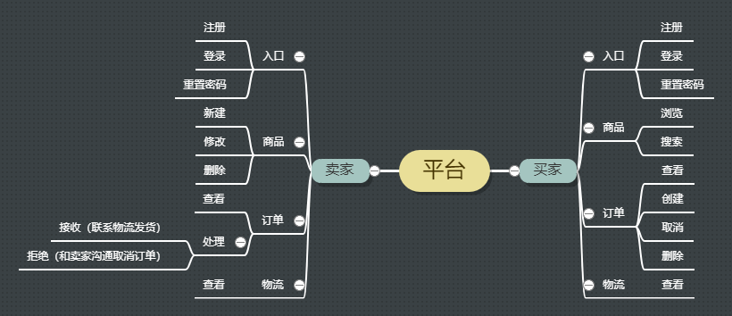
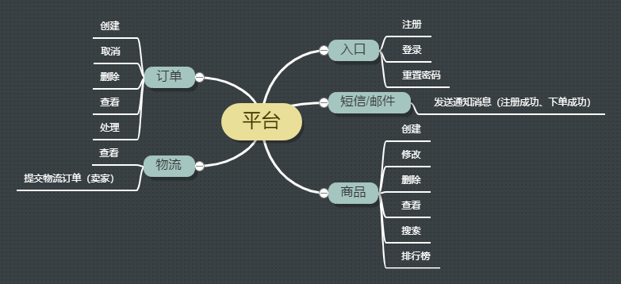
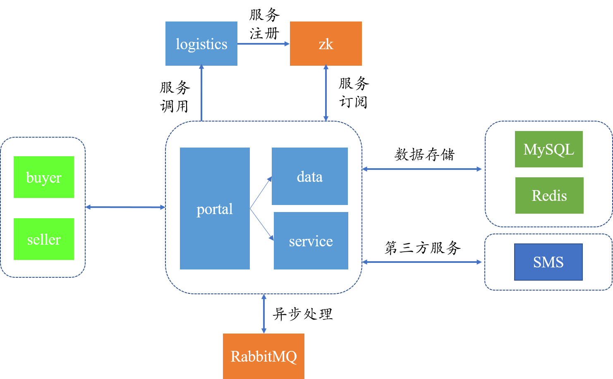
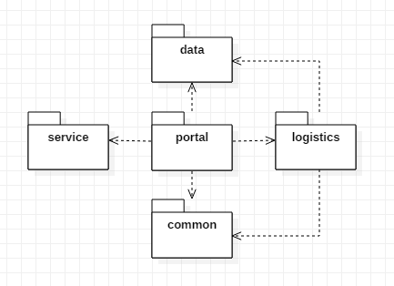

### 需求分析

#### 业务需求
产品作为一个购物平台，卖家可以在平台上发布商品，买家在平台浏览并下单购买商品，卖家收到订单会处理订单并及时发货，买家可以通过平台查看物流信息。

#### 用户需求

#### 功能需求

### 技术选型
1. SpringBoot基于“习惯优于配置”的原则极大地减少了Spring的配置，可以快速构建项目。选择SpringBoot作为IoC容器框架。
2. 相比于Struts，SpringMVC与Spring（SpringBoot）无缝结合，更容易上手。SpringMVC方法级别的拦截也更容易实现RESTful URL。选择SpringMVC作为表现层框架。
3. Hibernate实现了POJO和数据库表之间的映射，所有SQL都是自动生成和执行，屏蔽了底层细节，全自动化，开发量较小；MyBatis只做了参数和结果的映射，需要自己写SQL语句，半自动化，且SQL语句是数据库关联的，与数据库耦合度高，移植行较差，但由于自己写SQL，可以进行细致的SQL优化。当前项目比较简单，需求较少，无数据库性能要求，选择Hibernate作为持久层框架（接下来会学习Hibernate框架，最终具体使用根据学习情况而定）。
4. Memcached键名限制在250字节，值限制在不超过1MB，且只支持字符串结构（适用于只读数据的场景），无持久化方案，不支持主从；Redis的键和值都最大支持512M，支持多种数据结构（字符串、哈希、列表、集合、有序集合，应用场景非常多），支持数据持久化，支持主从。Memcached的使用场景在存储静态数据及只读的小数据上， 整体来说，Redis的功能要强于Memcached，所以选择Redis。（该应用会记录商品的浏览量，定期做排行榜）
5. 对于RPC框架和MQ产品目前都不熟悉，且当前项目没有特殊的场景需求只能用哪一个，所以最终选择相对熟悉的Dubbo和RabbitMQ。

技术 | 说明 | 官网
----|----|----
Spring Boot | 容器+MVC框架 | [https://spring.io/projects/spring-boot](https://spring.io/projects/spring-boot)
Hibernate | ORM框架 | [https://hibernate.org/](https://hibernate.org/)
Redis | 缓存 | [https://redis.io/](https://redis.io/)
RabbitMQ | 消息队列 | [https://www.rabbitmq.com/](https://www.rabbitmq.com/)
Dubbo | RPC服务 | [https://dubbo.apache.org/zh-cn/](https://dubbo.apache.org/zh-cn/)

### 系统设计

#### 系统架构图

#### 模块划分
- webmall-portal：前端页面的系统接口
- webmall-logistics-service：物流服务接口实现
- webmall-logistics-api：物流服务接口（用于暴露服务）
- webmall-common：公共服务实现
- webmall-data：数据管理
- webmall-service：封装外部接口或第三方平台服务

#### 数据库设计
// TODO

#### 接口设计
// TODO